# Firebase Messaging iOS

   

***Add the GoogleService-Info.plist file manually before starting the testing.***

Firebase Messaging iOS is a real-time messaging iOS application built from scratch using Firebase and Swift with pure code and the 'PDExtension (Swift Library).' 

It includes features such as automatic QR code generation, scanning QR codes to add friends, and easy switching to dark mode in the app.

|  |  |  |  |
| - | - | - | - |
| 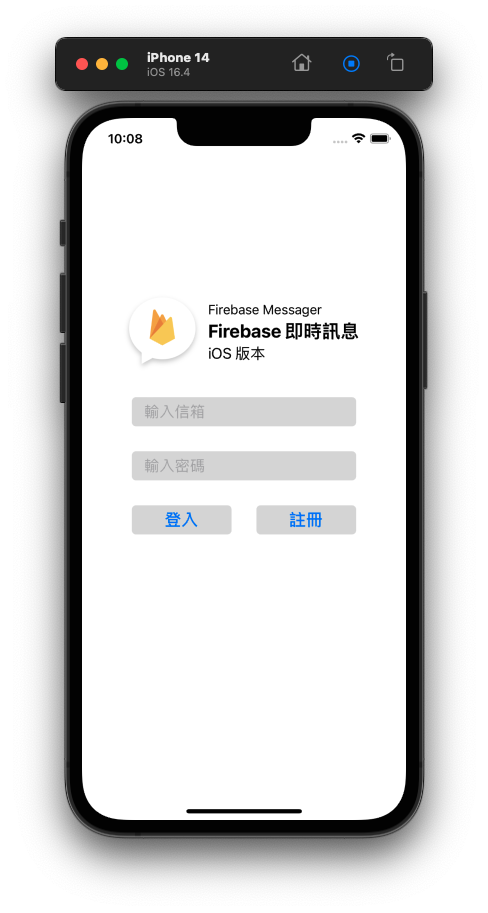 | 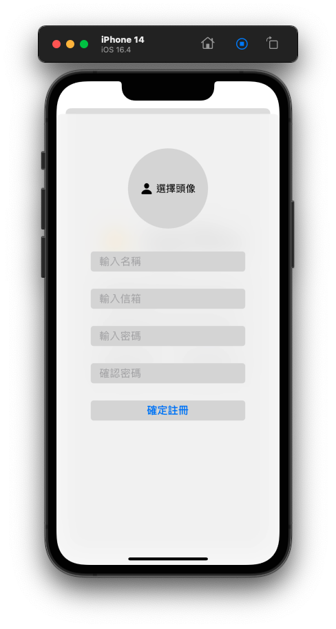 | 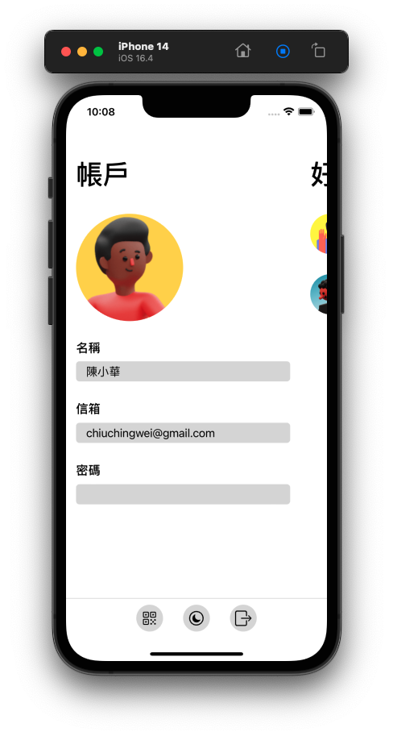 | 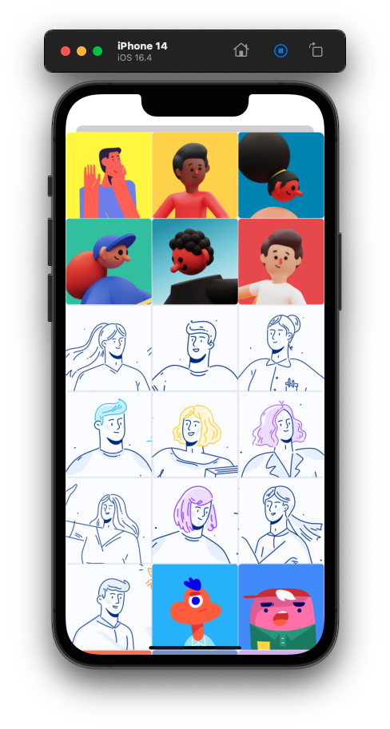 |
| 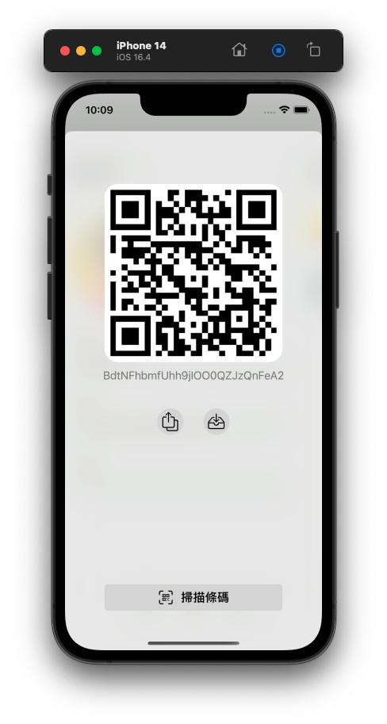 | 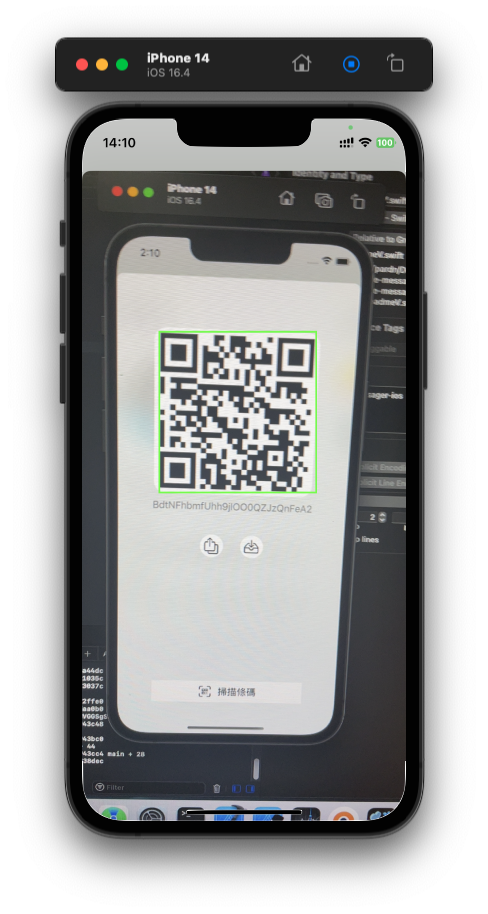 | 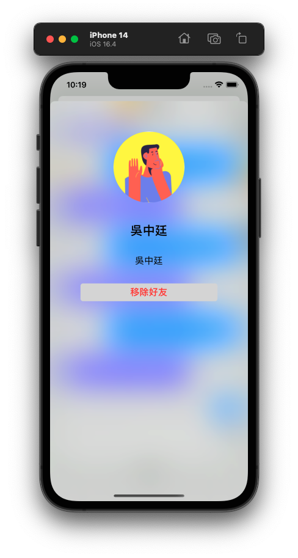 | 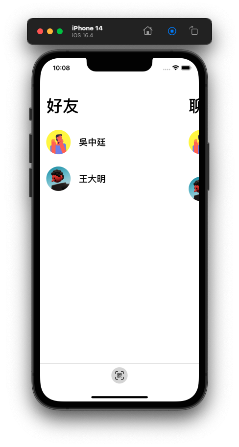 |
| 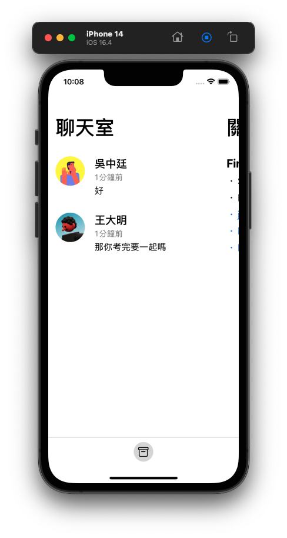 | 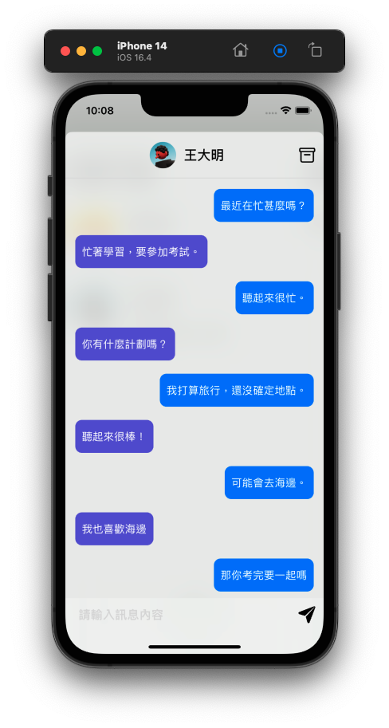 | 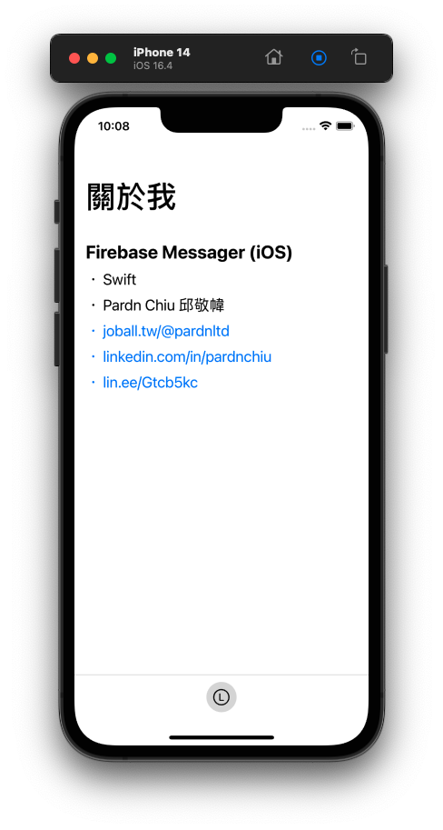 | |
| 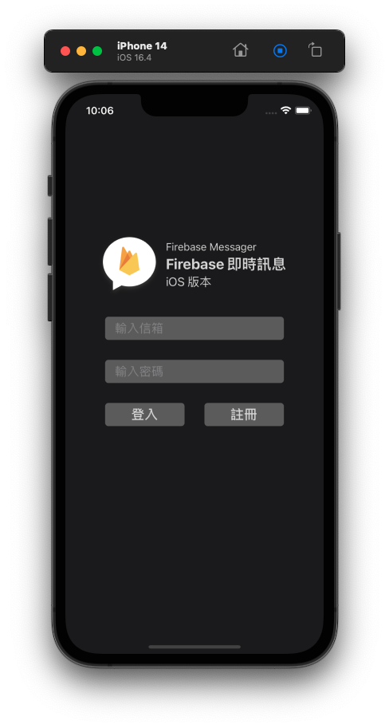 | 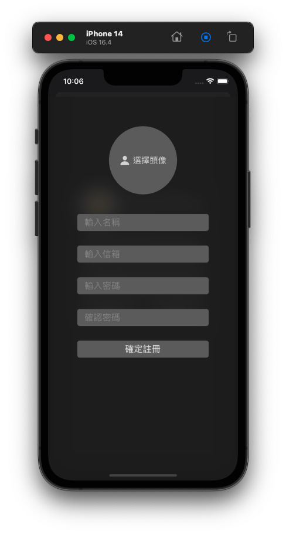 | 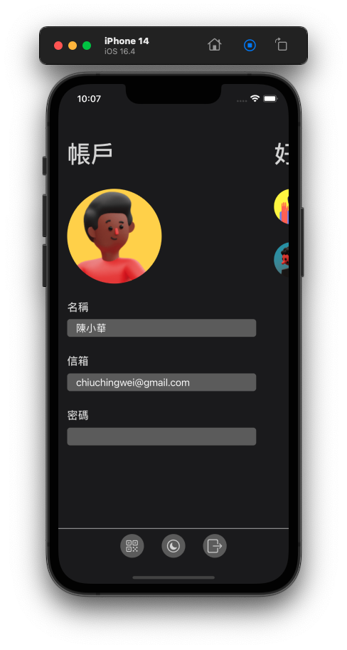 | 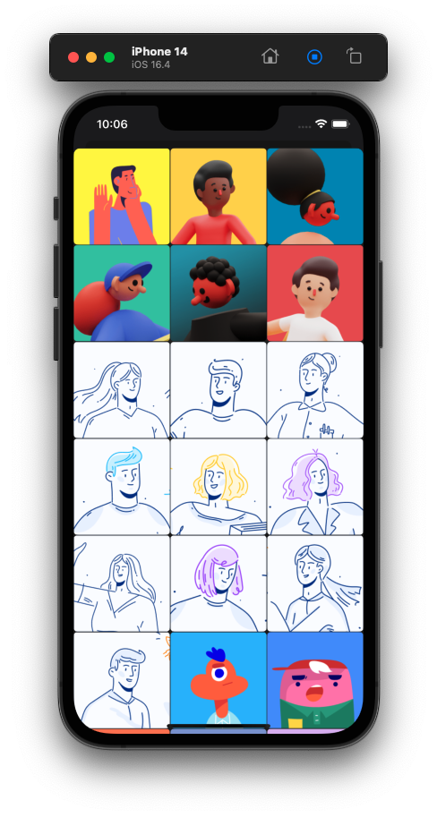 |
| 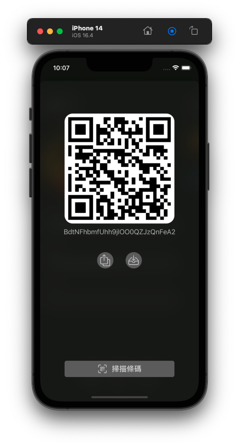 | 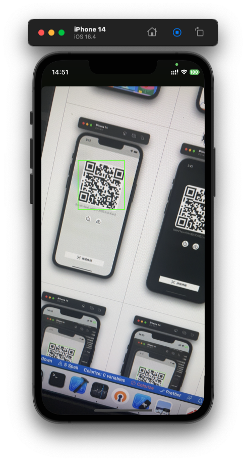 |  | 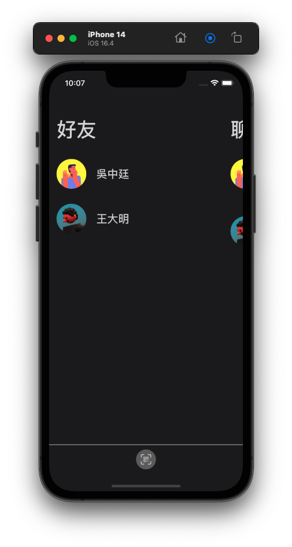 |
| 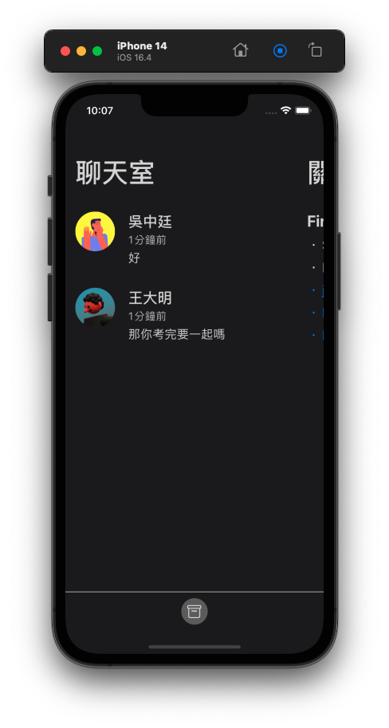 | 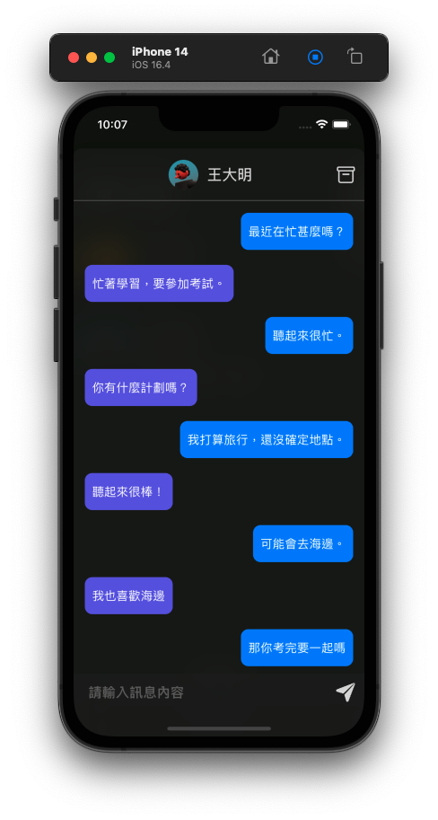 | 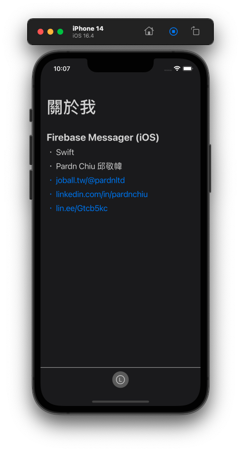 |

## Languages & Tools

## Feature

- Accelerate development with  [PDExtension Swift](https://github.com/pardnchiu/PDExtension-swift).
- Use [Userpics](https://userpics.craftwork.design) photos.

## Contributor

### 邱敬幃 Pardn Chiu

&nbsp&nbsp

 
 
 

